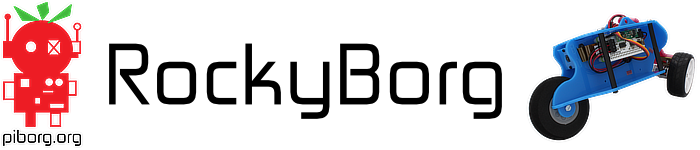

[](https://piborg.org/rockyborg)

The [RockyBorg](https://www.piborg.org/rockyborg) is a robotic tricycle designed to work with either a Raspberry Pi Zero or a full sized Raspberry Pi.

It steers by pivoting the robot body where the front wheel, camera and Raspberry Pi are mounted.  This gives RockyBorg easy to control steering and a tilting camera viewpoint.

Shop: [RockyBorg](https://www.piborg.org/rockyborg)

# Quick Start Guide
Our complete [Quick Start Guide](https://www.piborg.org/blog/rockyborg-quick-start-guide) will show you how to use the ```rbTuningGui.py``` to setup the steering and ```rbJoystick.py``` to control RockyBorg using a game controller.

# Install this Library
```
git clone https://github.com/piborg/rockyborg
cd rockyborg
bash install.sh
```
This will install the RockyBorg library, the setup GUIs and all dependencies needed to run the set of examples contained here.

# RockyBorg Library
```RockyBorg.py``` contains the RockyBorg library with lots of functions describing how to use the RockyBorg's motor controller. For a full breakdown of the API available please see the RockyBorg API (link coming soon).

# Examples
There are several examples in this repository to give you an idea of how to use the library with hardware.

## ```rbTestGui.py```
Control the motors and servo in the RockyBorg using a GUI with slider bars for each output. This can be used to check things are connected correctly and working properly.

## ```rbTuningGui.py```
Setup the servo's movement range using a GUI with slider bar. The setup for this example is explained in our [Quick Start Guide](https://www.piborg.org/blog/rockyborg-quick-start-guide).

## ```rbJoystick.py```
Control RockyBorg using a PS4 controller and [Pygame](https://www.pygame.org/).  It can also be easily adjusted to work with other game controllers.

## ```rbWeb.py```
Control RockyBorg using a browser on you phone, tablet or PC via WiFi. Full tutorial is [available on our website](https://www.piborg.org/blog/build/rockyborg-build/rockyborg-web-ui).

# Troubleshooting
For troubleshooting with the RockyBorg please refer to our [troubleshooting pages](https://www.piborg.org/blog/rockyborg-troubleshooting) and for further help please post questions on our [forum](http://forum.piborg.org/forum/rockyborg).

# Reporting Issues

If you find a bug with the RockyBorg code, please feel free to report it as an issue. When reporting issues with this library please fill in the issue report with as much information as you can to help us help you.

Please supply as much information as you can so we can replicate the bug locally. :)

